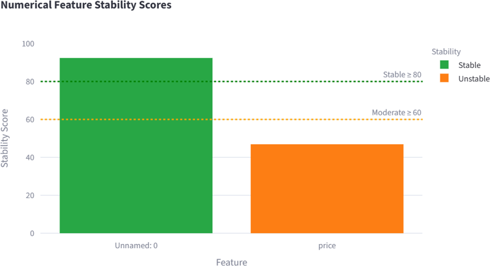
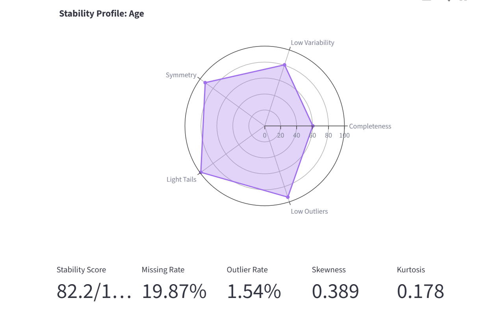

Feature Stability Analysis
==========================

Overview
--------

Feature stability analysis evaluates the quality and reliability of features within a dataset.
The objective is to identify features that are suitable for analysis and machine learning tasks,
while highlighting features that may contain excessive missing values, extreme distributions,
or a large number of outliers.

In AutoEDA, each feature is assigned a stability score ranging from 0 to 100.
Higher scores indicate more reliable and well-behaved features.

Why Feature Stability Matters
-----------------------------

Data quality has a direct impact on the performance of statistical analysis and machine learning
models. Features with high levels of missing data, extreme skewness, or excessive variability
can negatively affect model accuracy and interpretability.

Feature stability analysis helps users:

* Identify problematic features early in the analysis process.
* Detect data quality issues.
* Prioritize feature engineering efforts.
* Decide which features should be transformed, cleaned, or removed.
* Improve downstream machine learning performance.

Numerical Feature Stability
---------------------------

For numerical features, the stability score is calculated using several statistical indicators.

Missing Rate
^^^^^^^^^^^^

Features with a high percentage of missing values receive a penalty because incomplete data
reduces reliability and may require imputation.

Coefficient of Variation
^^^^^^^^^^^^^^^^^^^^^^^^

The coefficient of variation measures the amount of variability relative to the mean.
Extremely high variability may indicate instability within the feature.

Skewness
^^^^^^^^

Skewness measures the asymmetry of a distribution.

* A skewness value close to zero indicates a symmetric distribution.
* Large positive skewness indicates a long right tail.
* Large negative skewness indicates a long left tail.

Highly skewed distributions may require transformation before modeling.

Kurtosis
^^^^^^^^

Kurtosis measures the heaviness of the tails of a distribution.

Features with excessive kurtosis often contain extreme observations that may influence
statistical analysis.

Outlier Rate
^^^^^^^^^^^^

The outlier rate represents the percentage of observations identified as outliers using
the Interquartile Range (IQR) method.

Features containing a large proportion of outliers receive a lower stability score.

Categorical Feature Stability
-----------------------------

Categorical features are evaluated using different criteria.

Missing Rate
^^^^^^^^^^^^

The proportion of missing values within the feature.

Entropy
^^^^^^^

Entropy measures the uncertainty or randomness of categorical values.

Low entropy indicates that a small number of categories dominate the feature.

High entropy indicates a more balanced distribution of categories.

Cardinality
^^^^^^^^^^^

Cardinality refers to the number of unique categories contained within a feature.

Features with extremely high cardinality may be difficult to encode and model.

Mode Frequency
^^^^^^^^^^^^^^

Mode frequency represents the percentage of records belonging to the most common category.

A very high mode frequency may indicate that the feature provides limited information.

Stability Classification
------------------------

AutoEDA categorizes features according to their stability score.

+---------------+-------------+
| Stability     | Score Range |
+===============+=============+
| Stable        | > 80        |
+---------------+-------------+
| Moderate      | 60 - 80     |
+---------------+-------------+
| Unstable      | < 60        |
+---------------+-------------+

The following figure shows an example of how AutoEDA categorizes features according to their stability score.

Interpreting Results
--------------------

Stable features are generally suitable for analysis and machine learning without significant
modification.

Moderately stable features may require preprocessing such as transformation, scaling, or
missing value treatment.

Unstable features should be carefully reviewed and may require substantial preprocessing
or removal from the dataset.

The following figure shows an example of how AutoEDA shows the stability profile of every feature.

Limitations
-----------

The stability score is intended as a heuristic indicator and should not replace domain
knowledge or expert judgment.

Certain features may receive low stability scores while still being valuable for predictive
modeling, depending on the application and business context.