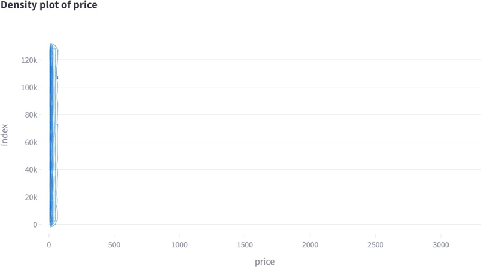
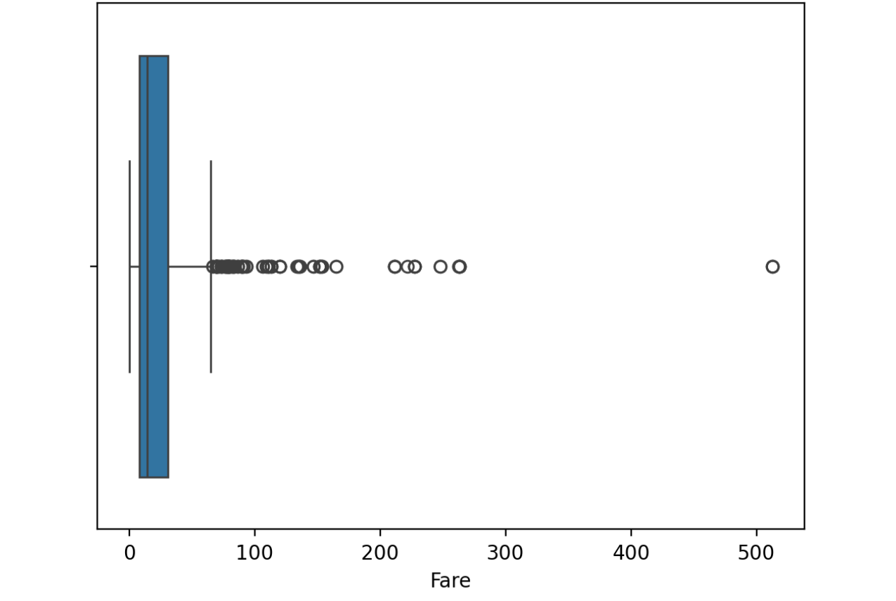

Data Preprocessing
==================

Overview
--------

The preprocessing module prepares raw datasets for analysis.

The following figure shows an example of how AutoEDA shows the stability profile of every feature.

Missing Values
--------------

Supported methods:

* Drop rows
* Drop columns
* Mean imputation
* Median imputation
* Mode imputation

Encoding
--------

* Label Encoding: Converts categorical text or string values into numerical integer labels
* One-Hot Encoding: Converts categorical data (such as text, labels, or words) into a numerical binary format

Scaling
-------

* StandardScaler: Standardizes features by removing the mean and scaling the data to unit variance. It gives your data a mean of 0 and a standard deviation of 1.
* MinMaxScaler:  Normalizes data by scaling features to a specific, bounded range—typically between 0 and 1.

Outlier Treatment
-----------------

AutoEDA provides:

* Outlier detection using IQR
* Outlier removal
* Outlier transformation using median replacement
The following figure shows an example of how AutoEDA shows the boxplot of a feature, and then deal with outliers either by removing outliers or transforming them by replacing their value with the mean of non-outlier values.

