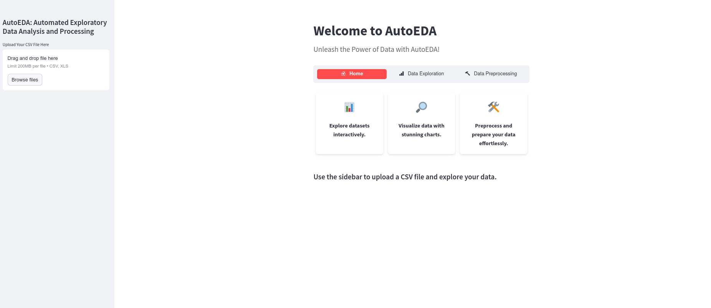

# AutoEDA — Automated Exploratory Data Analysis

A web-based, no-code EDA and preprocessing platform built with Streamlit. Upload any CSV or Excel file and instantly explore, visualize, and preprocess your data.



---

## Features

### Data Exploration
- **Dataset Overview** — row/column counts, duplicates, missing values, data types, and summary statistics
- **Visualizations** — histograms, scatter plots, density plots, box plots, pie charts, correlation heatmaps, pair plots, and more
- **Feature Stability Report** — per-feature stability scores (0–100) based on missing rate, coefficient of variation, skewness, kurtosis, and outlier rate; includes radar chart drill-down per feature

### Data Preprocessing
- Remove unwanted columns
- Handle missing values — drop rows or fill with mean / median / mode
- Encode categorical variables — One-Hot Encoding or Label Encoding
- Scale numerical features — Standardization or Min-Max Scaling
- Detect and handle outliers — remove or cap using IQR
- Download the preprocessed dataset as CSV

---

## Tech Stack

| Layer | Libraries |
|---|---|
| UI | Streamlit, streamlit-option-menu, streamlit-extras |
| Data | Pandas, NumPy, SciPy, scikit-learn |
| Visualization | Plotly, Matplotlib, Seaborn |
| File support | openpyxl (xlsx), xlrd (xls) |

---

## Getting Started

### Option 1 — Docker (recommended)

Requires [Docker Desktop](https://www.docker.com/products/docker-desktop).

```bash
git clone https://github.com/marounelhajj/AutoEDA.git
cd AutoEDA
docker compose up --build
```

Open `http://localhost:8501` in your browser.

### Option 2 — Local Python

Requires Python 3.9+.

```bash
git clone https://github.com/marounelhajj/AutoEDA.git
cd AutoEDA
pip install -r requirements.txt
python -m streamlit run main.py
```

Open `http://localhost:8501` in your browser.

---

## Supported File Formats

| Format | Extension |
|---|---|
| CSV | `.csv` |
| Excel 97-2003 | `.xls` |
| Excel 2007+ | `.xlsx` |

Maximum upload size: **200 MB**

---

## Project Structure

```
AutoEDA/
├── main.py                        # App entry point and page routing
├── home_page.py                   # Home page UI and styling
├── data_analysis_functions.py     # Exploration and visualization functions
├── data_preprocessing_function.py # Preprocessing functions
├── feature_stability_functions.py # Feature stability report
├── requirements.txt               # Python dependencies
├── Dockerfile                     # Docker image definition
├── docker-compose.yml             # Docker Compose config
├── .streamlit/
│   └── config.toml                # Streamlit theme and server settings
└── example_dataset/
    └── titanic.csv                # Sample dataset for testing
```

---

## Feature Stability Report

The stability report scores each feature from **0 to 100**:

| Score | Label |
|---|---|
| 80 – 100 | Stable |
| 60 – 79 | Moderate |
| 40 – 59 | Unstable |
| 0 – 39 | Highly Unstable |

**Numerical features** are scored on:
- Missing rate (up to −30 pts)
- Coefficient of Variation — std/mean (up to −25 pts)
- Skewness (up to −20 pts)
- Excess Kurtosis (up to −15 pts)
- Outlier Rate via IQR (up to −10 pts)

**Categorical features** are scored on missing rate, cardinality, mode dominance, and entropy.

---

